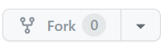
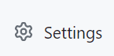
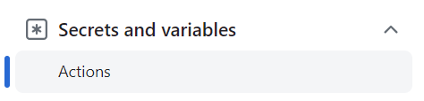
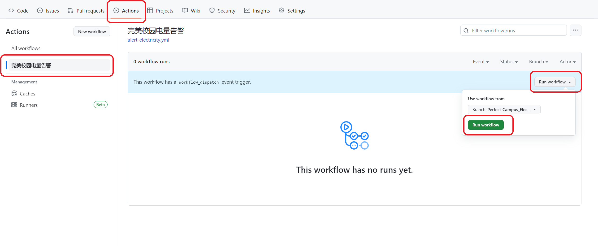
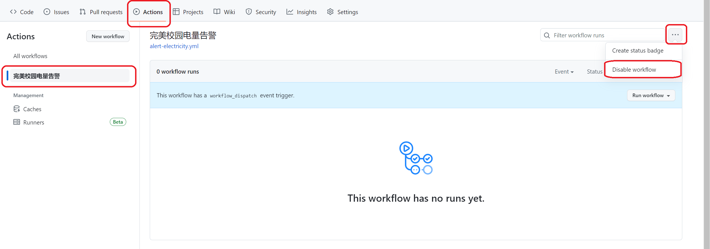

# 完美校园-电量告警

## 点个⭐star支持作者

支持在宿舍电量低于设定的低电量值和即将停电值时发送告警

支持微信、QQ、钉钉推送

该脚本每日11时和17时会自动查询绑定的宿舍剩余电量，低于设定值时发送告警!

语言:JavaScript

# 如何使用

### 1.在完美校园app登录账号，并**绑定房间**(只能绑定一个房间)

### 2.记录学号:完美校园app → 我的 → 点击头像 → **记下学号**

### 3.点击**Fork**,将该仓库复制到自己账号

### 3.打开复制好的仓库

依次点击**Settings**→**Secrets and variables**→**Actions**→**New repository secret**

### 4.然后根据下表依次填入 **Name** 和 **Secret**

| Name                 | Secret                                                       |      |
| :------------------- | ------------------------------------------------------------ | :--: |
| school_id            | 填写学校ID   [点击获取学校ID](./school-list.md)              | 必填 |
| student_id           | 填写学号                                                     | 必填 |
| alert_threshold      | 填写提醒阈值,只需要填数字,单位是度,如10                      | 必填 |
| alert_superthreshold | 填写急提醒阈值(即将停电),只需要填数字,单位是度,如3           | 必填 |
| WX_message_key       | [点击获取](https://sct.ftqq.com/login)  需要关注公众号接收通知 | 3填1 |
| QQ_message_key       | [点击获取](https://qmsg.zendee.cn/login)  需要先在QQ添加机器人为好友 | 3填1 |
| DD_webhook           | [点击查看获取方法](./DingDing_bot.md)                        | 3填1 |

若WX_message_key、QQ_message_key、DD_webhook多项被填写，则微信>QQ>钉钉

### 5.确认secret添加完成后，点击

**Actions → 完美校园电量告警 → Run workflow → Run workflow**

### 6.完成

## 如何停止推送?

Actions → 完美校园电量告警 → 三个点 → Disable workflow 即可禁用

# 注意事项

#### 1.该脚本调用完美校园接口，运行受接口影响

#### 2.一个学号在app中建议只绑定一个房间，否则脚本运行可能会出错